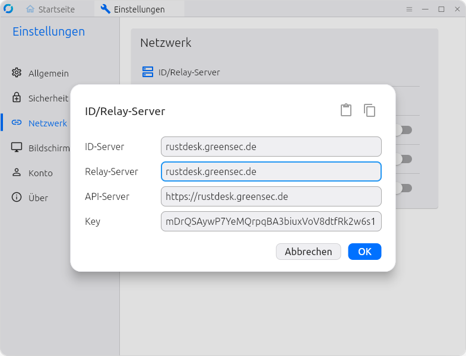

<header class="site-header">
  

    

      <h1>{{ site.data.config.client_name | default: site.title }}</h1>
      

        <button class="lang-btn" data-lang="en" aria-pressed="false">EN</button>
        <button class="lang-btn" data-lang="de" aria-pressed="false">DE</button>
      

    

    

      <a class="btn btn-hero" href="#downloads" data-i18n="downloads.title">Downloads</a>
      <a class="btn btn-hero btn-secondary" href="#config" data-i18n="config.title">Server Configuration</a>
    

  

</header>

<main class="container">

  <!-- Downloads -->
  <section class="section" id="downloads">
    

      
Recommended for this device

      <h3 id="recommended-title">Choose a download</h3>
      

      <a class="btn" id="recommended-link" href="#downloads">View options</a>
    

    

    <h2 class="section-title" data-i18n="downloads.title">Downloads</h2>

    

      <!-- Linux -->
      

        <h3>
          <i class="ti ti-brand-ubuntu icon"></i>
          Linux
        </h3>
        
Detected on this device

        
        <ul>
          
          <li><a class="download-link" href="{{ asset.url }}" download data-asset-name="{{ asset.name | escape }}">{{ asset.name }}</a></li>
          
        </ul>
        
        
No Linux builds available yet.

        
      

      <!-- Windows + macOS column -->
      

        <!-- Windows -->
        

          <h3>
            <i class="ti ti-brand-windows icon"></i>
            Windows
          </h3>
          
Detected on this device

          
          <ul>
            
            <li><a class="download-link" href="{{ asset.url }}" download data-asset-name="{{ asset.name | escape }}">{{ asset.name }}</a></li>
            
          </ul>
          
          
No Windows builds available yet.

          
        

        <!-- macOS -->
        

          <h3>
            <i class="ti ti-brand-apple icon"></i>
            macOS
          </h3>
          
Detected on this device

          
          
          
          <ul>
            
            <li><a class="download-link" href="{{ macos_x64.url }}" download data-asset-name="{{ macos_x64.name | escape }}">{{ macos_x64.name }}</a></li>
            
            
            <li><a class="download-link" href="{{ macos_arm64.url }}" download data-asset-name="{{ macos_arm64.name | escape }}">{{ macos_arm64.name }}</a></li>
            
          </ul>
          

            These are official upstream builds. They do not include your self-hosted server configuration.
            <a href="#config" data-i18n="macos.noteLink">See the manual setup steps.</a>
          

          
          
No macOS builds available yet.

          
        

      

      <!-- Android -->
      

        <h3>
          <i class="ti ti-brand-android icon"></i>
          Android
        </h3>
        
Detected on this device

        
        <ul>
          
          <li><a class="download-link" href="{{ asset.url }}" download data-asset-name="{{ asset.name | escape }}">{{ asset.name }}</a></li>
          
        </ul>
        
        
No Android builds available yet.

        
      

    

  </section>

  <!-- Server Configuration -->
  <section class="section" id="config">
    <h2 class="section-title" data-i18n="config.title">Server Configuration</h2>
    

      

        <i class="ti ti-alert-triangle config-warning-icon"></i>
        The downloads on this page are <strong>pre-configured</strong>. You only need this section if you are using the <strong>macOS</strong> upstream client or a regular RustDesk client.
      

      

        

          
          
Scan this QR code in the RustDesk mobile app

        

        

          
Copy this config string and paste it into RustDesk via <strong>Settings → Network → Import Server Config</strong>:

          <textarea class="config-string" id="config-string" aria-label="Encoded RustDesk server configuration" data-i18n-aria-label="config.textareaAria" readonly>{{ site.data.config.encoded_string }}</textarea>
          

            <button class="btn" data-copy="#config-string"><i class="ti ti-copy"></i> Copy Config</button>
          

        

      

      

        <h4><i class="ti ti-copy"></i> Quick Import (recommended)</h4>
        <ol>
          <li data-i18n-html="manual.quickStep1">Open RustDesk and click the <strong>menu button</strong> (⋯) next to your ID.</li>
          <li data-i18n-html="manual.quickStep2">Select <strong>Network</strong> and unlock the settings with elevated privileges.</li>
          <li data-i18n-html="manual.quickStep3">Click <strong>Import Server Config</strong> and paste the config string above.</li>
        </ol>
      

      

        <h4><i class="ti ti-keyboard"></i> Manual Entry</h4>
        <ol>
          <li data-i18n-html="manual.manualStep1">Open RustDesk → <strong>Network</strong> settings (unlocked).</li>
          <li><strong data-i18n="config.idServer">ID Server</strong>: <code>{{ site.data.config.id_server | default: "—" }}</code></li>
          
          <li><strong data-i18n="config.relayServer">Relay Server</strong>: <code>{{ site.data.config.relay_server }}</code></li>
          
          
          <li><strong data-i18n="config.apiServer">API Server</strong>: <code>{{ site.data.config.api_server }}</code></li>
          
          <li><strong data-i18n="config.key">Key</strong>: <code>{{ site.data.config.key | default: "—" }}</code></li>
          <li data-i18n-html="manual.manualStepApply">Click <strong>Apply</strong> or <strong>OK</strong> to save.</li>
        </ol>
      

      

        
      

    

  </section>

  <noscript>
    

      Download links still work, but the recommended download panel, QR code, and copy buttons require JavaScript.
    

  </noscript>

</main>

<footer class="site-footer">
  

    

    Latest build: <a href="https://github.com/greensec/rustdesk-client/releases/tag/{{ site.data.release.tag }}" target="_blank" rel="noopener"><code>{{ site.data.release.tag }}</code></a> (prerelease) |
    
    <a href="https://greensec.de" target="_blank" data-i18n-html="footer.impress">Impress</a>
    

  

</footer>
